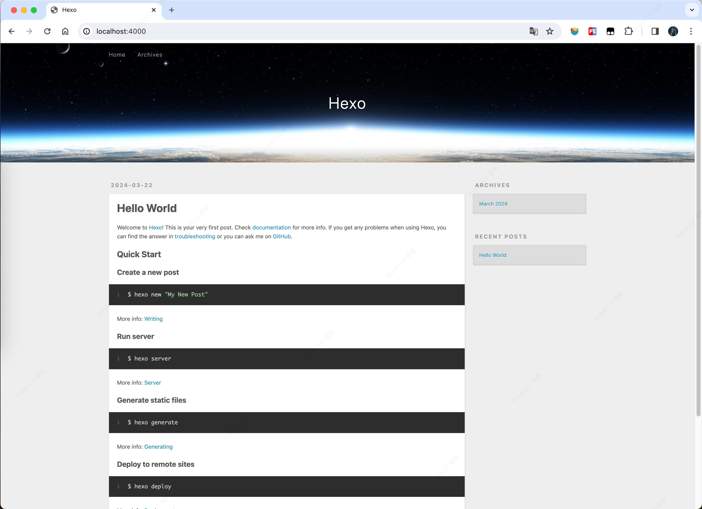
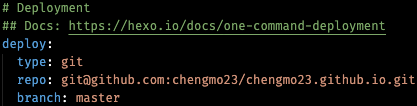
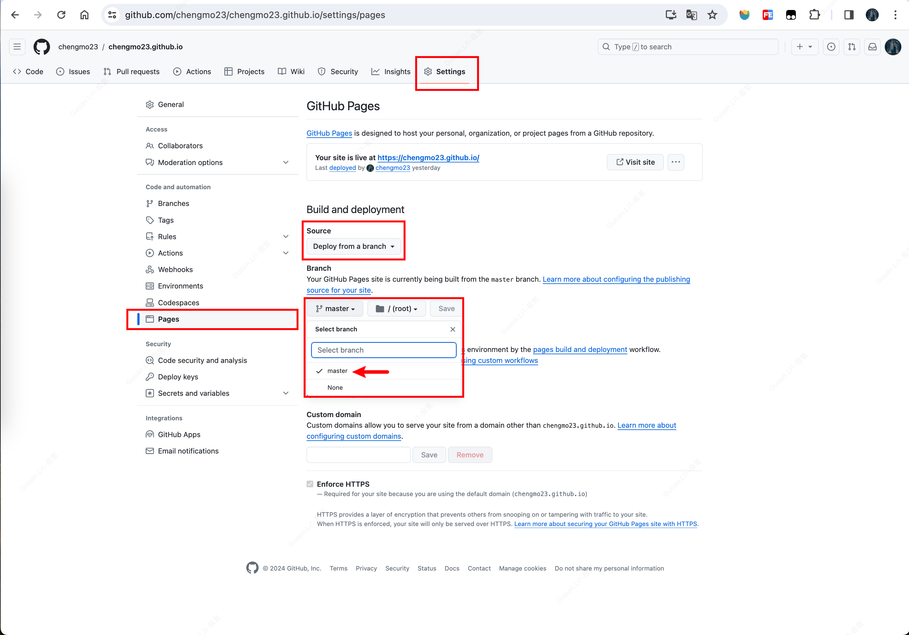

# 框架搭建

## 环境准备

### Node.Js
`Hexo` 是一个快速、简单且强大的静态博客框架，它使用 `Node.js` 为平台。所以我们先安装 [NodeJs](https://nodejs.org/en/download)

### Hexo
接下来就需要安装 `Hexo` 了，这是一个博客框架，`Hexo` 官方还提供了一个命令行工具，用于快速创建项目、页面、编译、部署 `Hexo` 博客，所以在这之前我们需要先安装 `Hexo` 的命令行工具。


命令如下：
```bash
npm install -g hexo-cli
```
## 初始化项目

首先使用如下命令创建项目：
```bash
hexo init {name}
```
这里的 name 就是项目名，我这里要创建 chengmo 的博客，我就把项目取名为 chengmo 了，用了纯小写，命令如下：
```bash
hexo init chengmo
```
接下来我们首先进入新生成的文件夹里面
```bash
cd chengmo
```
然后调用 Hexo 的 generate 命令，将 Hexo 编译生成 HTML 代码，命令如下：
```bash
hexo generate / hexo g
```
可以看到输出结果里面包含了 js、css、font 等内容，并发现他们都处在了项目根目录下的 public 文件夹下面了。

然后我们利用 Hexo 提供的 serve 命令把博客在本地运行起来，命令如下：
```bash
hexe serve / hexo s
```
运行之后命令行输出如下：
```bash
INFO  Start processing
INFO  Hexois running at http://localhost:4000 . Press Ctrl+C to stop 
```
它告诉我们在本地 4000 端口上就可以查看博客站点了：[http://localhost:4000](http://localhost:4000)

如图所示：



***<u>这样一个博客的框架就搭建出来了，我们只用了三个命令就完成了</u>***

---


# 服务部署
刚才搭建的博客服务只是运行在本地电脑上，接下来我们来将这个初始化的博客进行一下部署到 `Github Pages` 上。

## Github 仓库
我们需要一个 `Github` 账号，然后在 `Github` 上创建一个仓库名与 `Github` 用户名相同的代码仓库且必须是公共的，以存放网页文件供外部访问

## 部署到 Github Pages
那么怎么把这个页面部署到 `GitHub Pages` 上面呢，其实 `Hexo` 已经给我们提供一个命令，利用它我们可以直接将博客一键部署，不需要手动去配置服务器或进行其他的各项配置。

部署命令如下：
```bash
hexo deploy
```
在部署之前，我们需要先知道博客的部署地址，它需要对应 GitHub 的一个 Repository 的地址，这个信息需要我们来配置一下。

打开根目录下的 _config.yml 文件，找到 Deployment 这个地方，把刚才新建的 Repository 的地址贴过来，然后指定分支为 master 分支，最终修改为如下内容：


另外我们还需要额外安装一个支持 Git 的部署插件，名字叫做 hexo-deployer-git，有了它我们才可以顺利将其部署到 GitHub 上面，如果不安装的话，在执行部署命令时会报如下错误：
```bash
Deployer not found: git
```
那就让我们安装下这个插件，在项目目录下执行安装命令如下：
```bash
npm install hexo-deployer-git --save
```
安装成功之后，执行部署命令：
```bash
hexo deploy / hexo d
```
## 设置 Github Pages
部署成功后，我们还展示无法访问，还需对仓库进行设置，步骤如下：


选择 `_config.yml` 中配置的 `branch` 分支后，保存即可

耐心等待一会，我们就可以通过 https://chengmo23.github.io 进行访问了

---

# 其他配置
此外，我们还可以配置博客的`站点信息、主题皮肤、导航栏、标签分类、文章发布`等


### 相关链接:
- [官方网站](https://hexo.io)
- [Hexo主题](https://hexo.io/themes/)
- [本站主题-Async](https://hexo-theme-async.imalun.com/)